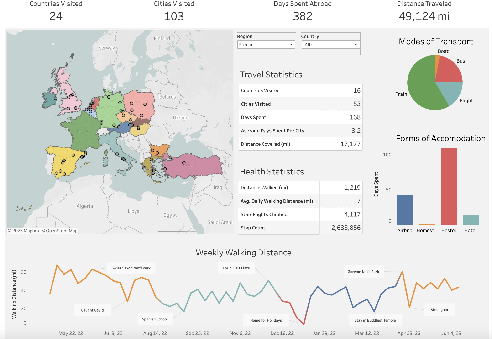

# World Trip Summary Dashboard

In May of 2022 I decided to embark on a trip of a lifetime, I packed up a backpack and set out on my own to see the world. Over the course of more than a year, I traveled across 24 countries through Asia, Europe, and South America. The experience was one of the most valuable experiences of my life, as I learned to connect and understand people from a variety of backgrounds, as well as to adapt to complex and difficult situations. And after a lot of reflection, I realized I want to have a career related to data analytics. Data is everywhere, and I love that it can be harnessed to gain new insights and make meaningful changes. That's something I'd love to be a part of.

This passion project was a meeting of my two loves, travel and data. Using the trip data I could collect manually and from my phone applications, I was able to put together a dataset detailing many of the facets of my trip, such as destinations, modes of transport and hospitality, distance walked, and more. Using this data I was able to perform calculations and create pivot tables to breakdown and summarize this data further. And finally, I used the data visualization software Tableau to create an intuitive, comprehensive dashboard, allowing users to get a high level summary of my experience from an analytical perspective.

## [Tableau Dashboard](https://public.tableau.com/app/profile/zachary.richardson3402/viz/ZachsWorldTour2022-2023/InteractiveDashboard)
## [Excel Dashboard](https://docs.google.com/spreadsheets/d/17IJQ4-dOZ-JBmA6An54MUpQgqhY7QVXnoAbPKNo7Ja4/edit?usp=sharing)

